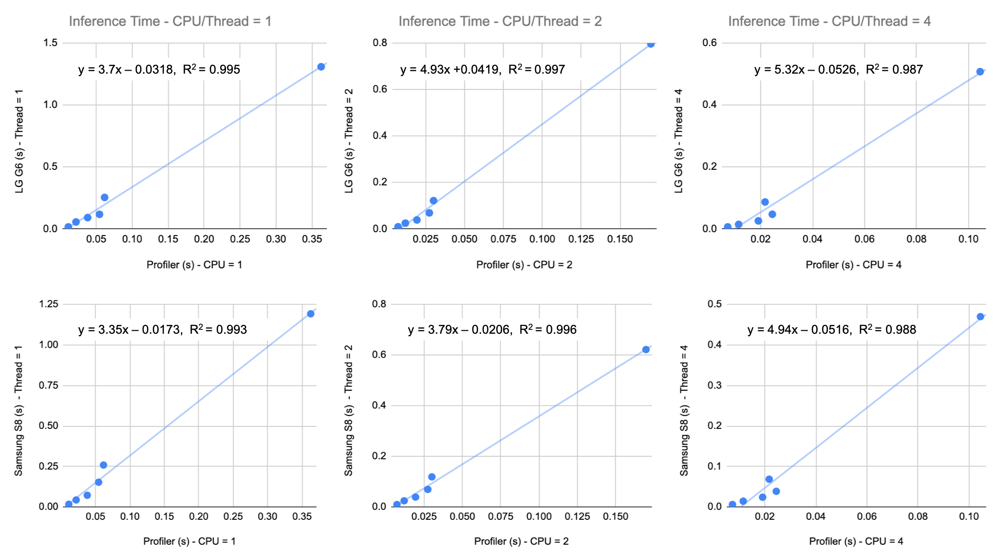
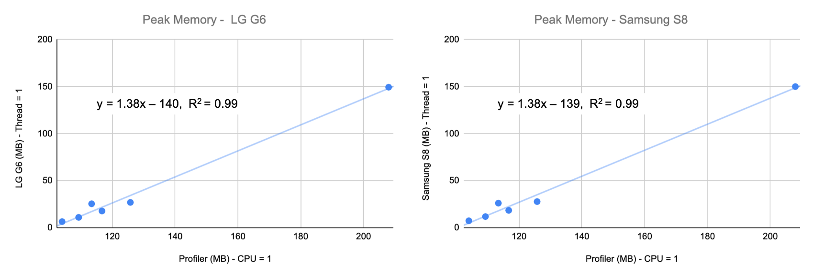

# Use Profiler for On-Device Resource Footprint Estimation
Profiler can be used to estimate model script performance and resource requirements for a target device on the development machine. Given a set of models and the resource constraints (i.e. memory and CPU) to reflect *target device specs* or *the desired resource budget*, Profiler can help with the following **two scenarios**:  
1. The ranking of the running times and memory usages of the models measured using Profiler on the development machine is indicative of their ranking on the target device. For instance, if `Model1` is faster than `Model2` when measured using Profiler on the development machine, `Model1` will be faster than `Model2` on the device. This ranking is valid only when the CPUs are running at **full utilization**.

2. The runtimes and memory usages of the models measured using Profiler on the development machine is related by a simple **linear relationship** to the usage measured with a native profiling tool on the actual device. In other words, if a model runs in time `x` when measured using Profiler, it will run approximately in time `(a*x+b)` (where `a` and `b` can be discovered by profiling a few models on the device with a native profiling tool). The strength of this relationship depends on the architectural similarity between the models. In general, the models designed for the same task are architecturally similar as they are composed of the same set of layers, making Profiler a useful tool for model selection.

To support these claims and showcase Profiler's capabilities, we have conducted extensive experiments on three devices: LG G6, Samsung S8, and NVIDIA Jetson Nano. For anyone interested in conducting similar experiments on their own devices, we have put together the following Experiment Guidelines.   

## Guidelines for Experiment Setup
The goal of the experiment is to explore the relationship of model runtime and resource footprint measured using Profiler on the development machine and model runtime and resource footprint measured with a native profiling tool on a target device. 

**For the first scenario**, to get a performance ordering of models, the user can acquire the CPU and memory constraints of the target device, and run Profiler on a desktop CPU with those constraints. Please make sure that the models used in Profiler match those to be deployed on-device (e.g., both are TFLite models). Our experiments show that the output from Profiler should provide the relative goodness of models for CPU-based devices.

In some cases, when two models are very close in performance (e.g., with peak memory usage difference of ~10MB), a flipped ordering might be observed on-device compared to Profiler output. However, the performances should still be close to each other.

**For the second scenario**, to acquire a linear relationship between Profiler estimates and on-device performance, the user needs to profile a set of models both using Profiler on the development machine and with a native profiling tool on the target device. Below, are the general steps to conduct this experiment.  

- ***Step 1***: Prepare the models and profiling scripts for both Profiler and the target device. The models running on Profiler and on-device should be in the same format / generated using the same framework. The scripts running on Profiler and on-device may be written in different programming languages, but should implement the same functionality (e.g., both running inference using batch size 1 for 500 iterations).
- ***Step 2***: Acquire device resource constraints (i.e. number of CPU cores/threads and memory limit), and input these constraints in the Profiler user variables in `env.template`.
- ***Step 3***: Run experiments.
  - Run the profiling script using Profiler for all models on a desktop CPU. 
  - Run the profiling script using a native profiling tool on the target device.
- ***Step 4***: Due to possible variances across experiments, we recommend running Step 3 multiple times and taking the averages of the measured metrics for further analysis.
- ***Step 5 (optional)***: Use any regression analysis tool to establish the relationship between Profiler outputs and the on-device measurements for the profiled models.

## Experiment I - Profiler and TFLite Model Benchmark for LG G6 and Samsung S8 Deployments
### Experiment Configurations:
- ***Models:*** InceptionV3, SqueezeNet, MobileNetV2-0.25x, -0.5x, -0.75x, -1.0x
- ***Profiling script:*** Profile inference performance. Run inference using a selected model for 500 iterations with batchsize 1 on randomly generated input
- ***Framework:*** TFLite
- ***CPU:*** CPU = 1, 2, 4 for Profiler, use Thread = 1, 2, 4 on the phone
- ***Memory:*** Max memory is 4 GB for both phones, but the memory variable is set to 2 GB in Profiler, which simulates a lower memory limit.
- ***On-device profiling tool:*** [TFLite Model Benchmark Tool](https://github.com/tensorflow/tensorflow/tree/master/tensorflow/lite/tools/benchmark)

### Results:
The experiment was conducted 5 times. We measured the average inference time on one input sample across 500 iterations, and the peak memory usage. The averages of 5 experiments are shown in Figures 1 and 2. The formula and R-squared value for the best fitting line are also shown in the plots.

Even though Profiler only outputs the script's total execution time, users can utilize the Profiler environment and measure the execution time of different functions in their profiling script like we did in this experiment. An example script for measuring the inference time is provided in [script](https://gitlab.lgsvl.net/samarth.tripathi/Auptimizer_Profiler/blob/master/bench/test_perf.py).

||
|:--:| 
| *Figure 1: Model inference time measured with Profiler on the desktop vs TFLite Model Benchmark on LG G6, and Profiler on the desktop vs TFLite Model Benchmark on Samsung S8.* |

For both phones, a linear relationship can be established between the inference time measured in the Profiler environment and the inference time measured on the phones, for various numbers of CPUs/threads. 

||
|:--:| 
| *Figure 2: Peak memory usage measured on Profiler vs LG G6, and Profiler vs Samsung S8.* |

The peak memory usage does not vary much across the number of CPUs/threads. So we only present one representative plot with `CPU/thread = 1` for both phones. Again, a linear relationship can be observed. The dot on the right-upper corner represents the InceptionV3 model, in both Figures 1 and 2, which has a significantly larger resource footprint than the rest of the models.

## Experiment II - Profiler and Jetson Stats for Nvidia Jetson Nano Deployment
### Experiment Configurations:
- ***Models:***  
*Image classification models*: ShuffleNetV2-0.5x, SqueezeNet, MobileNetV2-1.0x, ResNet18, InceptionV3  
*Video classification models*: 3D-SqueezeNet, 3D-ShuffleNetV2-0.25x, -0.5x, -1.0x, -1.5x, -2.0x, 3D-MobileNetV2-0.25x, -0.5x, -0.75x, -1.0x, -2.0x  
(model credit to [Efficient-3DCNNs](https://github.com/okankop/Efficient-3DCNNs))  
- ***Profiling script:*** Profile inference performance. Run inference using a selected model for 500 iterations with batchsize 1 on randomly generated input
- ***Framework:*** Pytorch
- ***CPU:*** CPU = 1 for Profiler, use 1 CPU core on NVIDIA Jetson Nano 
- ***Memory Limit:*** Max memory on NVIDIA Jetson Nano is 4 GB. The memory variable is set to 4 GB in Profiler.
- ***On-device profiling tool:*** [jetson-stats](https://github.com/rbonghi/jetson_stats)

### Results:
We ran the experiment 5 times. For this experiment, we measured the script's total execution time (direct output from Profiler, denoted as `Runtime` in figures), average memory usage, and peak memory usage. The averages of these measures across five experiments are shown in Figures 3 and 4. The formula and R-squared value for the best fitting line are also shown in the plots.

||
|:--:| 
| *Figure 3: Image model performances measured using Profiler on the desktop and Jetson Stats on NVIDIA Jetson Nano.* |

||
|:--:| 
| *Figure 4: Video model performances measured using Profiler on the desktop and Jetson Stats on NVIDIA Jetson Nano.* |

Note that separate plots are made for image models and video models, respectively. This is due to the fact that video models profiled here are architecturally different from the image models. As we have discussed, Profiler estimation is only valid for models with similar architectures or layers. 

## Conclusion
From the experimental results shared above, we have shown that Profiler can help users build a good estimate of model runtime and memory usage on LG G6, Samsung S8, and NVIDIA Jetson Nano, for some popular image/video recognition models. We hope that Profiler's estimation capability can enable leaner and faster model development for resource-constrained devices.  

Profiler might have limitations for certain models/devices, resulting in inconsistencies between Profiler outputs and on-device measurements. Therefore, we welcome the community to run experiments on their device of choice and **report any inconsistencies or limitations via GitHub Issues**.   
